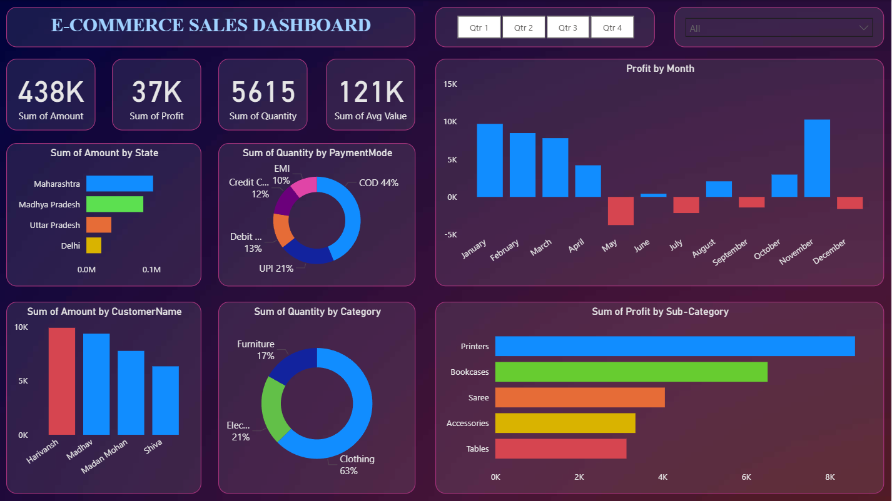

# E-Commerce Sales Dashboard 📊

## 📖 Project Overview
This Power BI dashboard analyzes online store performance using order and product-level data.  
The goal is to help business stakeholders track **sales, profit, customers, and product performance** interactively.

---

## 🗂️ Dataset
- **orders.csv** → Order-level information (Order ID, Customer, Region, Order Date, etc.)
- **details.csv** → Product-level details (Product Name, Quantity, Price, Discount, Profit)

Both datasets were joined in Power BI to build a unified sales model.

---

## ⚙️ Data Preparation
- Imported CSVs into **Power Query** for cleaning and transformations
- Created relationships between Orders and Order Details tables

---

## 📊 Dashboard Features
- KPIs: Total Sales, Profit, and Avg. Order Value
- Sales trends by Order Date
- Category & Sub-Category breakdown
- Regional and Customer segmentation

---

## 📌 Dashboard Preview

---

## 🎨 Dashboard Background

---

## 🚀 How to Use
1. Download the `.pbix` file:
   - `ecommerce-sales-dashboard.pbix`
2. Open it in **Power BI Desktop**
3. Interact with slicers, filters, and visuals for deeper insights

---

## 📖 Insights
- Seasonal spikes drive revenue peaks  
- Discounts increase sales volume but reduce profit margins in some categories  
- A small set of customers contributes a large share of total revenue (Pareto principle)  

---

## 📄 License
This project is part of the [Power BI Projects](../README.md) portfolio and licensed under **MIT License**.
